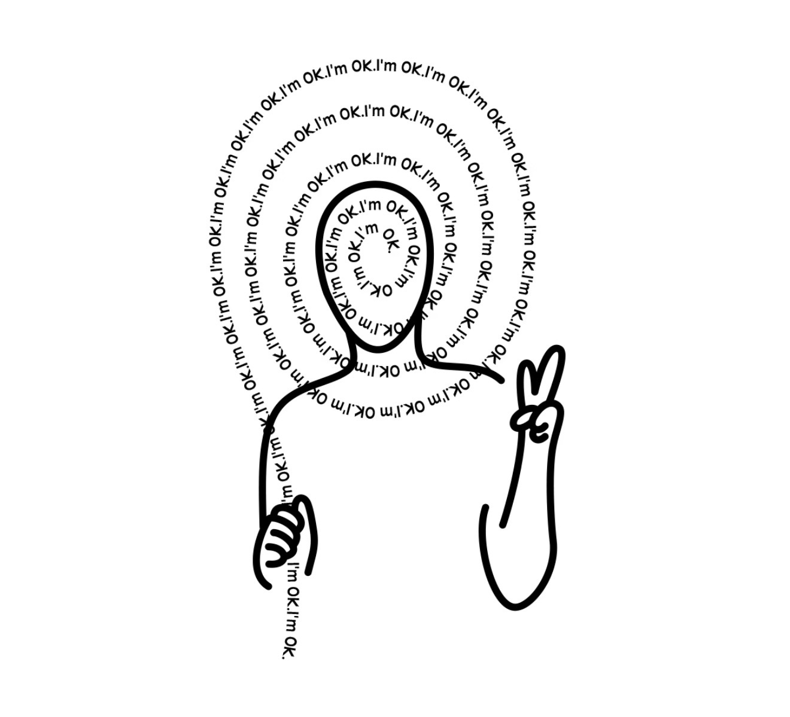

# mess → calm · 三幕交互小游戏

一个关于"从混乱到平静"的三幕网页交互小实验，单文件、无依赖、纯本地运行。

灵感来自单线描（one line art）风格的情绪插画：头顶缠绕的杂乱思绪，最终被一点点抚平。

## 运行

双击打开 `calm_interactive.html` 即可（无任何依赖，也可部署到任意静态空间）。

## 玩法（三幕）

| 幕 | 内容 | 交互 |
|---|---|---|
| 第一幕 | 头顶的 mess 乱麻缓慢搅动，红色的 **calm** 慢慢浮现 | 点击 calm |
| 第二幕 | 小人消失，mess 单词散开成快速移动的词阵，底部 ¿ 发射粒子 | ←→ / A·D 移动，空格或点击 ¿ 射击；命中 mess 变红，命中 calm 通关 |
| 第三幕 | 三排杂乱的线，起点与终点对齐 | 按住最左侧黑点向右拖动，乱线被逐渐拉直并保持 |

通关全部三幕，所有杂乱归于笔直与安静。

## 文件

- `calm_interactive.html` — 游戏本体（单文件，含全部逻辑）
- `gen_calm_game.py` — 页面生成器（改动参数后运行 `python3 gen_calm_game.py` 重新生成）
- `reference_IMG_0936.jpg` — 灵感参考图

## 重新生成

```bash
python3 gen_calm_game.py
```

调试参数（可选）：`?scene=2` 直接进入第二幕；`?scene=2&sim=秒` 快进游戏时间；`?scene=3&drag=0.8` 预设第三幕拉直程度。

## 参考图



*参考图：单线描风格的人像插画，头顶的线团由文字 "I'm OK" 缠绕而成（本项目第三幕与整体视觉风格的灵感来源）。*
